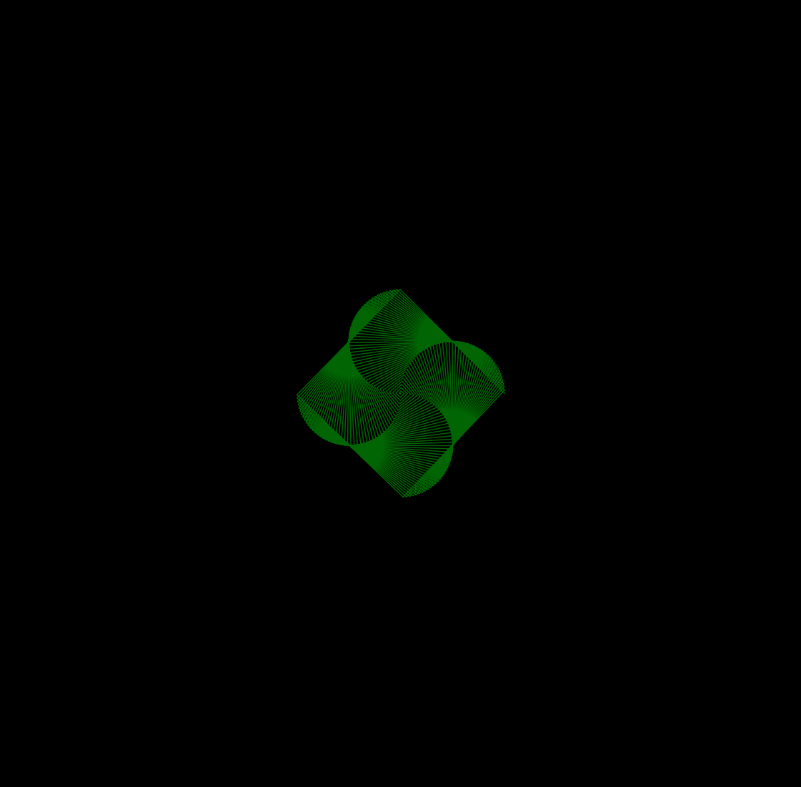
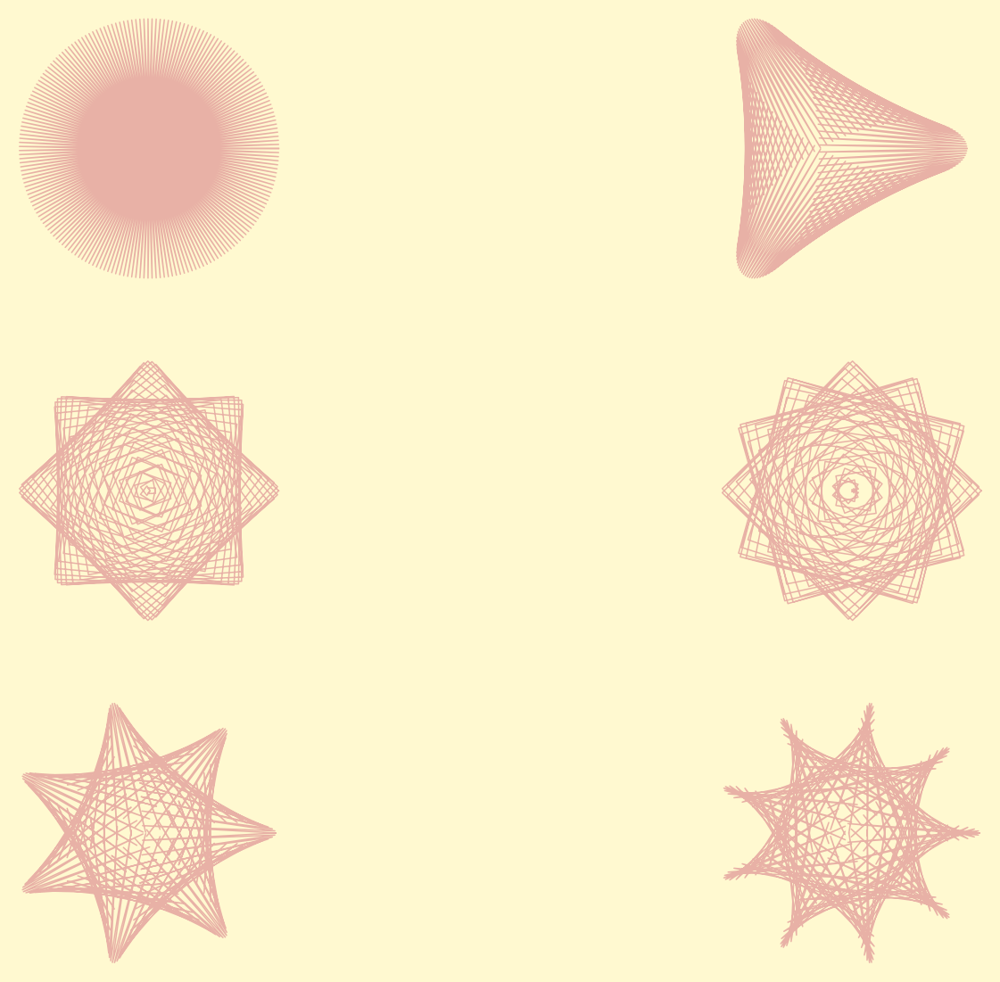

 # Small Math Programs
 
 This Repository contains some scripts and notebooks exploring concepts in math, physics, and scientific computing. I evntually want to create some kind of introuctory programming/scientific computing online course from it if I have the time and energy. Here's an example of some of the things created so far:
 
 ### Dice Faces from Dice Simulator
 
 
 
 
 
 
 
 ### Collatz onjecture Exloation
 
 
 
